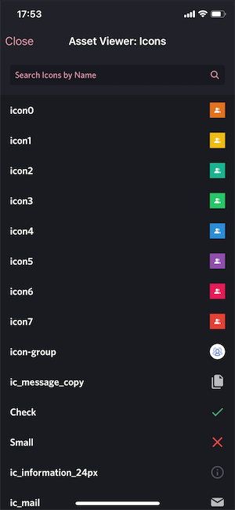
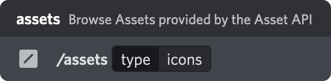

   <h3>Enmity AssetViewer</h3>

   Viewer of assets provided by the Enmity Asset API
   
    

---

>:warning: *Currently supports only icons, see [FAQ](#faq)*

>:new: *Check plugin settings for experimantal features*

## Features
- Browse icons
- Search icons
- Copy icons
- Perform satanic rituals

## How to Use

   
    
   <i>its a slash command duh</i>

## FAQ
>**Q: But.. there are no asset types in the Asset API, how do you know what's an icon?** 
A: There is a filter in place that determines the type by looking for keyfords in the filename and the directory it's located in. Please let me know if something is off, I'll adjust the filter.

>**Q: What about assets that are not icons?** 
A: The support is planned, but not a priority. A lot of the assets are pretty big, so the current list view used for icons won't cut it anymore.